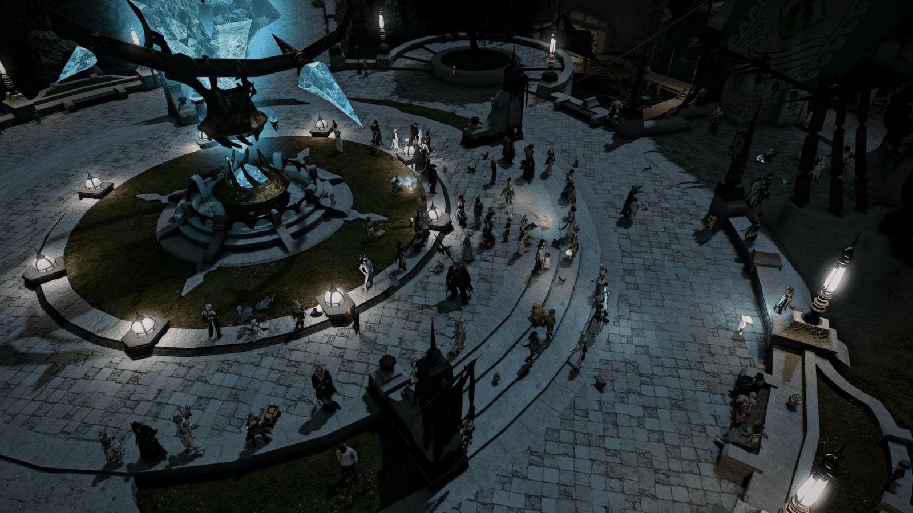
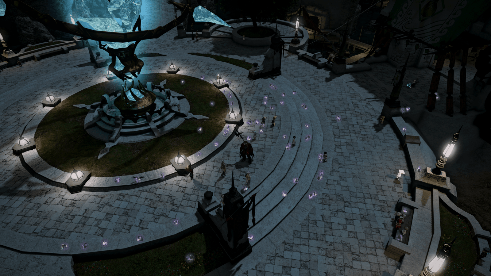

<p align="center">
  
</p>

<h1 align="center">Event Horizon</h1>

<p align="center">
  Cull what doesn't orbit you.
</p>

<p align="center">
  <a href="https://github.com/pyreymo/event-horizon/releases/latest"></a>
  
</p>

## Overview

**Event Horizon** is a Dalamud plugin for reducing visual clutter in crowded areas.

It hides distant or less relevant player characters while keeping important players visible, such as party members, friends, targets, recent chat participants, and nearby players. Optional cleanup rules can also hide attached objects, selected Event NPC clutter, and parts of the world scene.

The goal is simple: keep the world readable without turning every crowded city into a wall of character models.

**Vanilla (~50 FPS)**: 
**Event Horizon (110 FPS+)**: 

## Install

Add this custom plugin repository in Dalamud:

```text
https://raw.githubusercontent.com/pyreymo/event-horizon/master/repo.json
```

Then install **Event Horizon** from the plugin installer.

## How it works

Event Horizon applies hiding rules to other players around you.

Players are kept visible when they match enabled keep rules. Those rules can be reordered, and each rule can either count toward or bypass your visible-player budget.

For budgeted candidates, a deterministic Stable Top-B selector combines keep-rule priority, distance, short-term relative motion, and the currently visible set. This keeps the selected crowd steadier while you move instead of constantly swapping models at the visibility limit.

New player slots are held hidden until the active selection permits them, preventing newly loaded models from briefly flashing on screen before the next selection pass. Models switch visibility directly instead of using fade animations, while newly visible models are still admitted at a controlled rate.

Your own character is never hidden.

## Main features

### Smart player visibility

Hide other players in crowded areas while preserving players you are likely to care about.

Keep rules include:

- Friends
- Party and alliance members
- Current target and focus target
- Players targeting you
- Recent chat participants
- Nearby players
- Recruiting players
- Selected race and sex combinations

Keep rules can be reordered, enabled individually, and configured to either use or ignore the visible-player budget.

### Crowd limits

You can limit how many other players remain visible after keep rules are applied.

This is useful in cities, venues, hunt trains, and other crowded scenes. Budget-exempt rules can keep important players visible beyond that limit.

### Targeting-me marker

Event Horizon can mark players who are targeting you.

The marker can use a native nameplate icon, a lightweight screen-space dot, an optional world VFX marker, or any combination. The nameplate marker supports placement, scale, opacity, glow, and color controls; the dot has separate color and size controls, and the VFX can be disabled automatically in duties.

This is useful when you want to keep the "players targeting me" rule visible and easy to verify in crowded scenes.

### Live preview

The settings window includes a live preview of nearby players, showing who is visible or hidden, which keep rule matched, whether that player counts toward the budget, and the nearby-player keep range.

Preview dots can be selected while tuning rules, which makes it easier to see why a specific player is being kept or hidden.

The preview can also be popped out into a square floating window from the settings panel or with `/eh preview`.

Hovering or selecting a preview dot draws an in-world direction arrow from your character to that player. Selected preview players are temporarily kept visible and receive an orange world highlight while you inspect their rule and budget state.

### Attached objects and NPC cleanup

For other players, Event Horizon can also hide their:

- Minions
- Fashion accessories
- Battle pets

An experimental cleanup rule can also hide certain non-targetable Event NPCs and dialogue-only Event NPCs without active quest markers.

### Hidden-player markers

Hidden players can optionally receive a marker at their world position. You can use an in-world ground VFX or a less resource-intensive screen-space dot with configurable color, opacity, and size.

The dot does not follow in-game world occlusion, so it may remain visible through scene geometry.

### World graphics controls

Optional scene controls can hide the current area's BG Part graphics, terrain rendering, or both. These settings are disabled by default and operate independently from player hiding.

### Server info bar controls

Event Horizon can add a compact Server Info Bar entry for quick status and toggling.

The entry can show the current player-hiding state, optionally include FPS, and can be removed entirely from the behavior settings. An experimental native background can also be enabled for the full Server Info Bar.

### Safety options

Event Horizon can automatically suspend hiding:

- In duties
- When the number of other players is below your configured threshold

You can also preview the nearby-player keep range in the world.

## Commands

```text
/eventhorizon
/eh
/eh on
/eh off
/eh toggle
/eh preview
```

`/eventhorizon` and `/eh` are interchangeable.

`/eh preview` toggles the floating player preview window.

## Project layout

The plugin code is grouped by responsibility:

- `EventHorizon/Culling` contains player selection, admission gating, tracked visibility state, non-player cleanup, and keep-rule decisions.
- `EventHorizon/Dtr`, `EventHorizon/TargetingMarker`, and `EventHorizon/WorldGraphics` contain the Server Info Bar, marker rendering, world dots, and scene-graphics controls; shared native Atk and VFX code lives under `EventHorizon/Interop`.
- `EventHorizon/Preview` contains preview snapshots, preview rendering, the floating preview window, world arrows, and selected-player highlights.
- `EventHorizon/UI/Config` contains settings tabs and shared config-window layout helpers.
- `EventHorizon/Settings` contains persisted plugin configuration.

## Building from source

Install XIVLauncher, Dalamud, and the .NET SDK expected by the Dalamud SDK.

Clone this repository, then build:

```text
dotnet build .\EventHorizon\EventHorizon.csproj --configuration Release -p:Platform=x64
```

Tagged releases are built by GitHub Actions and published with `EventHorizon.zip`.
