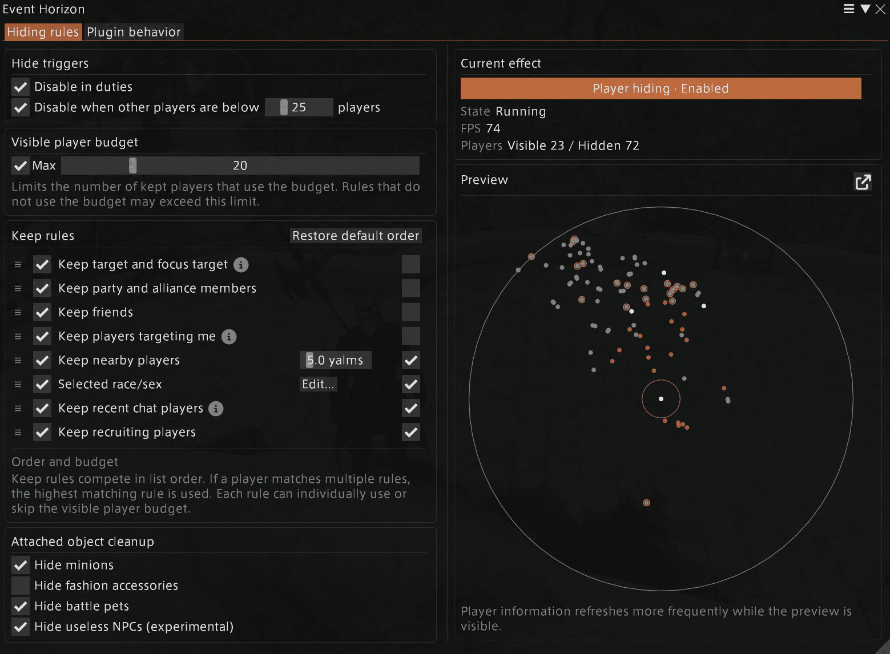

<p align="center">
  
</p>

<h1 align="center">Event Horizon</h1>

<p align="center">
  Cull what doesn't orbit you.
</p>

<p align="center">
  <a href="https://github.com/pyreymo/event-horizon/releases/latest"></a>
  
</p>

## Why Event Horizon?

**Event Horizon** is a Dalamud plugin that reduces crowd clutter and improves performance by hiding less relevant players.

Unlike FFXIV's built-in character limit, which broadly reduces the number of displayed characters, Event Horizon decides visibility per player. Party members, friends, targets, nearby players, and other configured priorities can remain visible even in the busiest areas.

**Native settings:** fewer characters, little control.  
**Event Horizon:** fewer characters, the right ones stay.

<p>
  <strong>Vanilla (~50 FPS)</strong><br>
  
</p>

<p>
  <strong>Event Horizon (110 FPS+)</strong><br>
  
</p>

## Install

Add the following custom plugin repository in Dalamud:

```text
https://raw.githubusercontent.com/pyreymo/event-horizon/master/repo.json
```

Then install **Event Horizon** from the plugin installer.

## Features



### Smart crowd culling

Set a maximum number of visible players and choose who should be kept:

- Friends, party and alliance members
- Current target and focus target
- Players targeting you
- Recent chat participants
- Nearby or recruiting players
- Selected race and sex combinations

Rules can be reordered, enabled individually, and made exempt from the visible-player limit.

Event Horizon applies rule priority to the game's freshly collected draw candidates. The game owns model hiding, restoration, and its overall draw limit. Exempt rules bypass only the plugin's player budget. Nearby-range and recent-target/chat rules remain; predictive selection and model-transition queues have been removed.

### Live player preview

See nearby players and inspect:

- Whether the rules admit or exclude them (actual drawing remains subject to game limits)
- Which rule matched them
- Whether they count toward the player limit
- Where they are relative to your character

Open the floating preview with:

```text
/eh preview
```

### Player and NPC cleanup

Event Horizon can also hide other players’:

- Minions
- Fashion accessories
- Battle pets

Optional experimental rules can remove certain non-targetable or dialogue-only Event NPCs.

### Markers

Players targeting you can be marked using a nameplate icon, screen-space dot, or world VFX.

Hidden players can also receive optional world-position markers, allowing you to track nearby activity without rendering every character model.

### World graphics controls

For additional performance or visual cleanup, Event Horizon can independently hide:

- Background objects
- Terrain
- Water
- Grass
- All 3D rendering

These controls are disabled by default.

### Safety and quick controls

Event Horizon can automatically suspend player hiding:

- In duties
- When the nearby player count is low
- While holding a configurable shortcut

A Server Info Bar entry can display the current state, show FPS, and quickly toggle the plugin.

Your own character is never hidden.

## Commands

```text
/eventhorizon
/eh
/eh on
/eh off
/eh toggle
/eh preview
```

`/eventhorizon` and `/eh` are interchangeable.

## Building from source

Install XIVLauncher, Dalamud, and the .NET SDK required by the Dalamud SDK.

```text
dotnet build .\EventHorizon\EventHorizon.csproj --configuration Release -p:Platform=x64
```

Tagged releases are built by GitHub Actions and published as `EventHorizon.zip`.

## Experimental native admission

Implementation contract and binary verification: [native admission](docs/native-admission.md).
